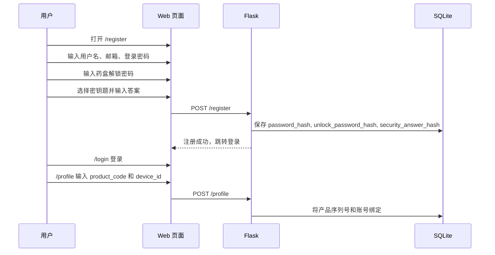
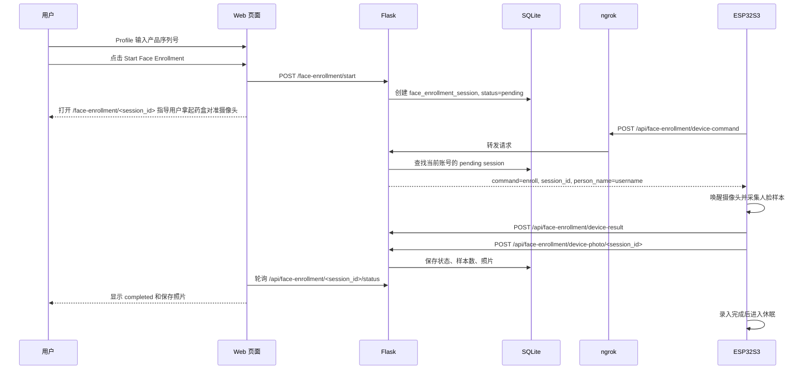
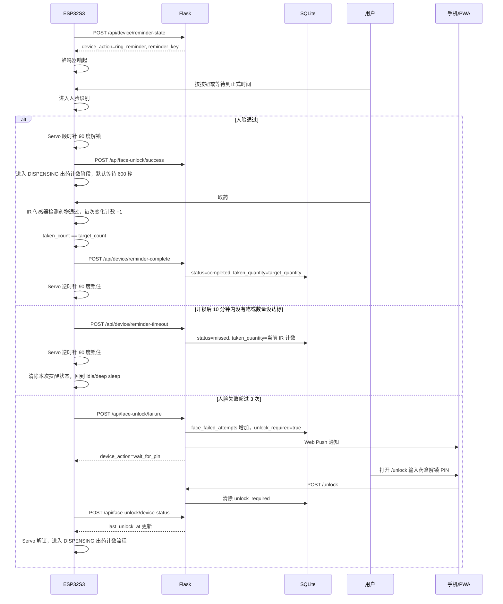

# Pill Box 网站、ESP 与 ngrok 测试交互逻辑关系

本文档把当前仓库中的 Flask 网站、SQLite 数据库、PWA 手机通知、XIAO ESP32S3 Sense 和 ngrok 暴露链路串成一套完整测试流程。重点是区分两件事：

- 当前代码已经具备的链路。
- 正式硬件流程中还需要继续补齐的链路。

## 1. 系统角色

| 角色 | 当前文件或位置 | 责任 |
| --- | --- | --- |
| 用户浏览器 | `templates/*.html`, `static/js/main.js` | 注册、登录、填写解锁密码、绑定产品序列号、设置服药计划、接收页面弹窗 |
| 手机 PWA | `static/manifest.json`, `static/sw.js` | 在 HTTPS 环境下接收后台通知，点击通知后进入 `/unlock` |
| Flask 后端 | `Pill_box_V2_01_English/Pill_box_V2_01_English/app.py` | 账号、数据库、设备 API、PWA Push、提醒状态判断 |
| SQLite | `instance/app.db` | 保存用户、产品码、设备 ID、服药计划、人脸录入会话、设备提醒事件 |
| ngrok | `start_with_ngrok.ps1` | 把本机 `http://127.0.0.1:5000` 变成公网 HTTPS URL，给手机和 ESP 访问 |
| XIAO ESP32S3 | `face_recognition_unlock_servo.ino` | 轮询网站提醒、蜂鸣器、按钮、人脸检测、舵机解锁、向网站报告成功或失败 |

## 2. ngrok 在系统中的位置

ngrok 不负责业务判断，它只负责网络转发。

```text
手机浏览器 / ESP32S3
        |
        | HTTPS: https://xxxx.ngrok-free.app
        v
ngrok 公网隧道
        |
        | 转发到本机
        v
Flask: http://127.0.0.1:5000
        |
        v
SQLite: instance/app.db
```

关键点：

- 手机和 ESP 不能访问电脑上的 `127.0.0.1:5000`，因为这个地址在手机和 ESP 上指向它们自己。
- 手机通知和 Service Worker 需要 HTTPS，所以手机测试必须使用 ngrok URL 或正式 HTTPS 域名。
- ESP 草图中的 `SERVER_BASE_URL` 必须填同一个 ngrok HTTPS URL。
- `.env` 中的 `DEVICE_API_TOKEN` 必须和 `.ino` 中的 `DEVICE_API_TOKEN` 一致。
- ngrok 每次重启如果生成新 URL，就要同步更新手机打开的网址和 ESP 草图中的 `SERVER_BASE_URL`。

## 3. 当前数据库关系

```text
user
  id
  username
  email
  password_hash
  unlock_password_hash
  security_question
  security_answer_hash
  product_code
  device_id
  face_failed_attempts
  unlock_required

supplement_schedule
  id
  user_id -> user.id
  supplement_name
  take_time
  time_window
  target_quantity
  note

face_enrollment_session
  id
  user_id -> user.id
  product_code
  status
  person_name
  requested_samples
  captured_samples
  device_id
  photo_data

device_reminder_event
  id
  user_id -> user.id
  schedule_id -> supplement_schedule.id
  reminder_key
  status
  device_id
  target_quantity
  taken_quantity
  completed_at
  missed_at
```

当前 `product_code` 相当于产品序列号或产品解锁码，示例是 `5506123`。`device_id` 用于把一个账号绑定到具体 ESP 设备，例如 `xiao-esp32s3-sense-5506123`。

## 4. 用户注册到产品绑定



当前已实现：

- 注册登录。
- 登录密码和药盒解锁密码分开存储。
- 密钥题和答案保存为哈希。
- Profile 页面可以绑定 `product_code` 和 `device_id`。

还需要补齐：

- “忘记药盒解锁密码”页面。目标逻辑是用户输入账号，回答密钥题，通过后重设 `unlock_password_hash`。

## 5. 首次人脸录入

目标流程：



当前已实现：

- Web 可以创建人脸录入会话。
- Web 人脸录入页会轮询状态。
- 后端已经有 ESP 端接口：`device-command`、`device-result`、`device-photo`。

还需要补齐：

- `.ino` 当前没有调用人脸录入 API。
- 当前只保存一张预览照片。若要严格实现“照片编号与用户账号名绑定”，建议增加 `face_photo` 表，保存 `photo_id`、`session_id`、`user_id`、`username`、`photo_index`、`device_photo_id`。
- 需要在 ESP 端加入首次录入状态机：发现 `command=enroll` 后唤醒摄像头、采集、上传结果和照片。

## 6. 用户设定药物和时间后动态联动 ESP

当前 Web 设定：

```text
Profile -> Add Supplement Schedule
supplement_name: 药物或补剂名称
take_time: 服药时间，例如 11:00
time_window: 时间区间，例如 +/-10 分钟
note: 备注
target_quantity: 本次需要取出的数量，也就是 Dose Quantity
```

ESP 获取状态：

```text
POST /api/device/reminder-state
Header: X-Device-Token: <DEVICE_API_TOKEN>
Body:
{
  "device_id": "xiao-esp32s3-sense-5506123",
  "product_code": "5506123",
  "event": "poll_reminder"
}
```

后端判断逻辑：

- 当前时间在 `take_time +/- time_window` 内，返回 `device_action=ring_reminder`。
- 当前用户已经进入 PIN 解锁状态，返回 `device_action=wait_for_pin`。
- 没有到时间，返回 `device_action=idle`，同时包含 `next_reminder`、`next_wake_at` 和 `sleep_seconds`。
- 到时间时返回 `dose_quantity`，ESP 用它作为 IR 传感器计数目标。

正式 deep sleep 目标：

```text
用户设定 11:00，窗口 +/-10 分钟
10:50 ESP 唤醒
10:50-11:00 蜂鸣器提示用户靠近
用户按按钮可以跳过蜂鸣，直接进入人脸识别
11:00 Web 和手机端发送提醒
11:10 如果仍未完成，可结束本次窗口或记录 missed
其他时间 ESP 进入 deep sleep
```

当前状态：

- 后端已经返回 `next_wake_at` 和 `sleep_seconds`。
- `.ino` 在 idle 且 `sleep_seconds >= 30` 时会进入 deep sleep，并用 timer wakeup 在下一次窗口前唤醒。
- 开发调试时如果不想让 ESP 休眠，可以把 `.ino` 中的 `ENABLE_DEEP_SLEEP` 改为 `false`。

## 7. 正式服药流程

目标流程：



当前已实现：

- 人脸失败上报：`POST /api/face-unlock/failure`。
- 三次失败后设置 `unlock_required=true`。
- Web 页面弹窗和 PWA Push。
- 用户进入 `/unlock` 输入药盒解锁密码后清除锁定状态。
- ESP 轮询 `POST /api/face-unlock/device-status`，发现 `last_unlock_at` 更新后继续解锁。
- 成功后 `POST /api/face-unlock/success` 重置失败次数。
- Web 计划页面支持设置 Dose Quantity。
- ESP 解锁后进入 `DISPENSING`，最多等待 600 秒。
- IR 传感器计数达到 Dose Quantity 后才调用 `/api/device/reminder-complete`。
- 10 分钟内没吃或数量不达标，ESP 调用 `/api/device/reminder-timeout`，后端标记本次记录为 `missed`。
- 完成或 missed 后，ESP 锁回舵机、清除本次提醒状态，回到 idle，并按下一次计划窗口 deep sleep。

还需要补齐：

- 更详细的服药历史页面。目前 missed/completed 状态保存在 `device_reminder_event`，Profile 只显示 missed 总数。
- 如果需要逐粒实时上传，可以再增加 `POST /api/device/intake-count`。当前实现是 ESP 本地计数，完成或超时时一次性上报数量。

## 8. 设备 API 对照表

| 场景 | 方法与路径 | 当前状态 | 说明 |
| --- | --- | --- | --- |
| ESP 查询是否要人脸录入 | `POST /api/face-enrollment/device-command` | 已有后端，ESP 未接入 | 返回 `command=idle` 或 `command=enroll` |
| ESP 上传录入结果 | `POST /api/face-enrollment/device-result` | 已有后端，ESP 未接入 | 保存 `started/completed/failed/expired` |
| ESP 上传录入照片 | `POST /api/face-enrollment/device-photo/<id>` | 已有后端，ESP 未接入 | body 是 JPEG 字节 |
| ESP 查询服药提醒 | `POST /api/device/reminder-state` | 已接入 | 返回 `idle/ring_reminder/wait_for_pin` |
| ESP 完成一次提醒 | `POST /api/device/reminder-complete` | 已接入 | IR 计数达到 Dose Quantity 后标记 `completed` |
| ESP 上报开锁未吃药 | `POST /api/device/reminder-timeout` | 已接入 | 600 秒内数量不达标后标记 `missed` |
| ESP 上报人脸失败 | `POST /api/face-unlock/failure` | 已接入 | 三次后 Web/PWA 提示 PIN |
| ESP 查询 PIN 解锁状态 | `POST /api/face-unlock/device-status` | 已接入 | 发现 `last_unlock_at` 变化后继续 |
| ESP 上报人脸成功 | `POST /api/face-unlock/success` | 已接入 | 清除失败次数 |
| ESP 上报 IR 数量 | 随 `reminder-complete` 或 `reminder-timeout` 上报 | 已接入 | ESP 本地计数，结束时提交 `taken_quantity` |

## 9. ngrok 测试步骤

### 9.1 准备 `.env`

在 `Pill_box_V2_01_English/Pill_box_V2_01_English/.env` 中至少配置：

```text
SECRET_KEY=change-this
DEVICE_API_TOKEN=5506-local-device-token
```

如果要测试手机后台 Push，还需要配置 VAPID：

```text
VAPID_PUBLIC_KEY=...
VAPID_PRIVATE_KEY=...
VAPID_CLAIMS_SUB=mailto:your-email@example.com
```

### 9.2 启动 Flask 和 ngrok

在项目根目录运行：

```powershell
.\run_tests.bat
```

或直接运行：

```powershell
powershell -NoProfile -ExecutionPolicy Bypass -File .\start_with_ngrok.ps1
```

看到类似下面的 HTTPS URL 后，把它作为统一测试入口：

```text
https://xxxx.ngrok-free.app
```

### 9.3 手机端测试

1. 用手机打开 ngrok HTTPS URL。
2. 注册并登录。
3. 进入 Profile。
4. 点击 `Enable Phone Alerts`。
5. 点击 `Send Test Notification`。
6. 关闭浏览器后，再触发三次人脸失败，确认手机能收到通知。

### 9.4 产品绑定和人脸录入页面测试

1. 在 Profile 中输入 `Product Unlock Code`，例如 `5506123`。
2. 输入 `XIAO Device ID`，例如 `xiao-esp32s3-sense-5506123`。
3. 保存 Profile。
4. 点击 `Start Face Enrollment`。
5. 保持页面打开，页面会轮询录入状态。
6. 当前如果没有 ESP 人脸录入逻辑，需要手动或脚本模拟设备 API 才能让状态变化。

### 9.5 ESP 草图配置

在 `face_recognition_unlock_servo.ino` 中同步修改：

```cpp
const char* WIFI_SSID = "你的 WiFi";
const char* WIFI_PASSWORD = "你的 WiFi 密码";
const char* SERVER_BASE_URL = "https://xxxx.ngrok-free.app";
const char* DEVICE_API_TOKEN = "5506-local-device-token";
const char* DEVICE_ID = "xiao-esp32s3-sense-5506123";
```

上传后打开串口监视器，期望看到：

```text
WiFi connected
POST /api/device/reminder-state -> HTTP 200
Waiting for the website database reminder.
```

### 9.6 无硬件模拟 ESP API

可以运行根目录中的测试脚本：

```powershell
.\test_ngrok_device_flow.ps1 -BaseUrl "https://xxxx.ngrok-free.app" -DeviceToken "5506-local-device-token"
```

这个脚本会模拟：

- ESP 查询当前提醒状态。
- ESP 连续上报三次人脸失败。
- ESP 查询是否进入 `wait_for_pin`。
- 提示你去 Web 的 `/unlock` 输入药盒解锁密码。

如果只测本机 Flask，可以把 `BaseUrl` 改成本机地址：

```powershell
.\test_ngrok_device_flow.ps1 -BaseUrl "http://127.0.0.1:5000" -DeviceToken "5506-local-device-token"
```

## 10. 推荐下一步实现顺序

1. 新增“找回药盒解锁密码”页面，通过密钥题重设 `unlock_password_hash`。
2. 增加服药历史页面，显示每次 `completed/missed`、目标数量、实际 IR 计数和时间。
3. 修改 ESP：接入 `/api/face-enrollment/device-command`、`device-result` 和 `device-photo`。
4. 如果需要更细粒度日志，再新增 `POST /api/device/intake-count`，让 ESP 每次 IR 变化都实时上报。
5. 为多人长期联调部署云端服务器，避免本机/ngrok 关机后无法访问。
